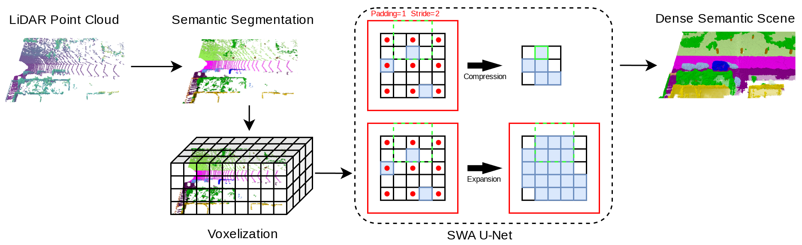

<div align="center">
  <h1 align="center">SWA-SOP: Spatially-aware Window Attention for Semantic Occupancy Prediction in Autonomous Driving</h1>

  <p align="center">
    <a href="https://helincao618.github.io/">Helin Cao*</a>, Rafael Materla*, and <a href=https://www.ais.uni-bonn.de/behnke/ target=_blank rel=noopener>Sven Behnke</a>
      <br>
      University of Bonn and Lamarr Institute, Bonn, Germany
    <br />
    <strong>SMC 2025</strong>
    <br />
    <a href="https://arxiv.org/abs/2506.18785">Arxiv</a> | <a href="https://sites.google.com/view/swasop">Project page</a>
    <br />
  </p>
</div>

# Teaser



# Preparing

Please follow the `/SWA-SOP/swasop/third_party/SparseTransformer/README.md`

# Running
All the scripts is controlled by the `/SWA-SOP/swasop/config/semantic_kitti.yaml`

## Training
```
python train.py --config path/to/config/semantic_kitti/
```

## Evaluation
- [Download the trained model](https://drive.google.com/file/d/1GauUHjrEQu6LMY1YlunbB0UJ77hXb33J/view?usp=sharing) and place the checkpoint file under `/path/to/kitti/logdir/trained_models/kitti.ckpt`.  
- Then update the ```resume``` path in ```config/semantic_kitti/``` accordingly.  
- The testing script can be found in the `third_party` folder.  


# Citation
If you find this work or code useful, please cite our paper and give this repo a star :)
```
@inproceedings{cao2025swasop,
  title = {{SWA-SOP}: Spatially-aware Window Attention for Semantic Occupancy Prediction in Autonomous Driving},
  author = {Cao, Helin and Materla, Rafael and Behnke, Sven},
  booktitle = {IEEE Int. Conf. on Systems, Man, and Cybernetics (SMC)},
  year = {2025},
}
```

# License and Acknowledgement

SWA-SOP is released under the [MIT license](./LICENSE). Our code follows several awesome repositories. We appreciate them for making their codes available to public.
- [SphereFormer](https://github.com/dvlab-research/SphereFormer)
- [SemanticKitti](https://github.com/PRBonn/semantic-kitti-api)
